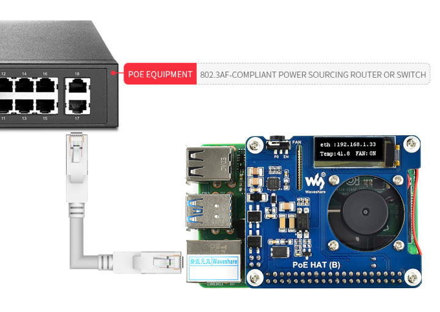

# Waveshare PoE HAT CLI (Command Line Interface)
Small command line interface for Waveshare PoE HAT B with OLED Display. 



## Features

 - Do whatever you like in shell (no need to recompile)
   - Control FAN
   - Control OLED (1 line, 2 lines, 3 lines and 4 lines)
 - Small binary

## Examples

### Control FAN

```shell
foo@bar:~$ sudo ./waveshare-poe-hat-b-cli fan on
Fan turned on!

foo@bar:~$ sudo ./waveshare-poe-hat-b-cli fan off
Fan turned off!
```

### Control OLED

```shell
foo@bar:~$ sudo ./waveshare-poe-hat-b-cli oled "row1"
row 1: row1
```
<div style="width: 50%; height: 50%">


</div>

```shell
foo@bar:~$ sudo ./waveshare-poe-hat-b-cli oled "row1" "row2"
row 1: row1
row 2: row2
```
<div style="width: 50%; height: 50%">


</div>

```shell
foo@bar:~$ sudo ./waveshare-poe-hat-b-cli oled "row1" "row2" "row3"
row 1: row1
row 2: row2
row 3: row3
```
<div style="width: 50%; height: 50%">


</div>

```shell
foo@bar:~$ sudo ./waveshare-poe-hat-b-cli oled "row1" "row2" "row3" "row4"
row 1: row1
row 2: row2
row 3: row3
row 4: row4
```
<div style="width: 50%; height: 50%">


</div>

### Script

Simple script [***example.sh***](example.sh)

```bash
#!/bin/sh -e

_fanState="off"
_fanOnTemperature="40000"
_fanOffTemperature="34000"

while true; do
    _temperature="$(cat /sys/class/thermal/thermal_zone0/temp)"

    _temperatureViewAwk="BEGIN { printf \"%.2f C\", (${_temperature}/1000) }"
    _temperatureView=$(awk "${_temperatureViewAwk}";)

    if (( "${_temperature}" > "${_fanOnTemperature}" )); then
        _fanState="on"
    elif (( "${_temperature}" < "${_fanOffTemperature}" )); then
        _fanState="off"
    fi

    ./waveshare-poe-hat-b-cli fan ${_fanState}
    ./waveshare-poe-hat-b-cli oled "T: ${_temperatureView}" "F: ${_fanState}"
    sleep 3
done
````
<div style="width: 50%; height: 50%">


</div>

### Run In Docker

Run example script.

```shell
foo@bar:~$ docker run --privileged -it pietmacom/waveshare-poe-hat-b-cli
```

Copy (***example.sh***)[example.sh], make your changes and run your new script.

```shell
foo@bar:~$ docker run --privileged -it -v yourscript.sh:/root/script.sh pietmacom/waveshare-poe-hat-b-cli
```

## Enable I2C Interface

I2C interface is required for the OLED display, you need to first enable the i2c interface for properly work.
Open a terminal of Raspberry Pi and configure:

```shell
foo@bar:~$ sudo raspi-config
Interfacing Options -> I2C -> Yes
```


And then reboot the system.

```shell
foo@bar:~$ sudo reboot
```

## Compile

```shell
foo@bar:~$ cd src
foo@bar:~$ ./make clean
foo@bar:~$ ./make
```
 
## References

Documentation (https://www.waveshare.com/wiki/PoE_HAT_(B))[https://www.waveshare.com/wiki/PoE_HAT_(B)]
